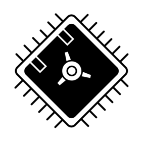

# pretty-secure-processor

A RISC-V core with a couple of security features. My project for ECE 527: System on a Chip Design.

# Running in Vivado
To run this in Vivado, first clone the repo somewhere local. Then, create a new Vivado project targetting the Pynq Z2 board.

When prompted to add design sources, add everything in the `hdl` and `memories` folders, as well as `kernel/kernel.mem`. This will allow the memory initialization files to be found by Vivado without the need to specify absolute paths.

To get simulation working, add everything in `hvl`, `memories`, and `kernel/kernel.mem` as simulation sources. Note that the memory initialization files need to be added again here.

## Simulation
For simulation, set the top testbench to be one of the following:

`hvl/tb_psp.sv`: Test the entire core

`hvl/tb_tft.sv`: Test the LCD-TFT Subsystem

`hvl/tb_memory.sv`: Test the TCM Memory

To enable `rvfi` verification, edit `hvl/tb_psp.sv` line 59 to remove the `& 0` preventing `rvfi` from receiving any instructions. This is in place because `rvfi` will throw unnecessary errors when PSP special operations happen (pointer HMACs or secure call/ secure ret).

## Synthesis
To synthesize the processor, set the top level module to be `hdl/psp.sv`.

Make sure to add `hdl/constraints.xdc` to the project!

## Kernel

Provided is a test kernel that will test a variety of features on the PSP. First, it will read its TCM memory region and compute a checksum / hash and output it to the screen. Then, it will perform a nested series of scall / sret. Finally, it will test precise exceptions and pointer HMACs by executing some malicious code that attempts to change the saved return address. This should cause an exception upon return as the HMAC has changed, and the exception handler should be called.

With return address HMACs enabled, the malicious subroutine is thwarted and we trap to the exception handler (x30):

With return address HMACs disabled, the malicious subroutine is able to adjust control flow and return to the "this string should never appear" code:

