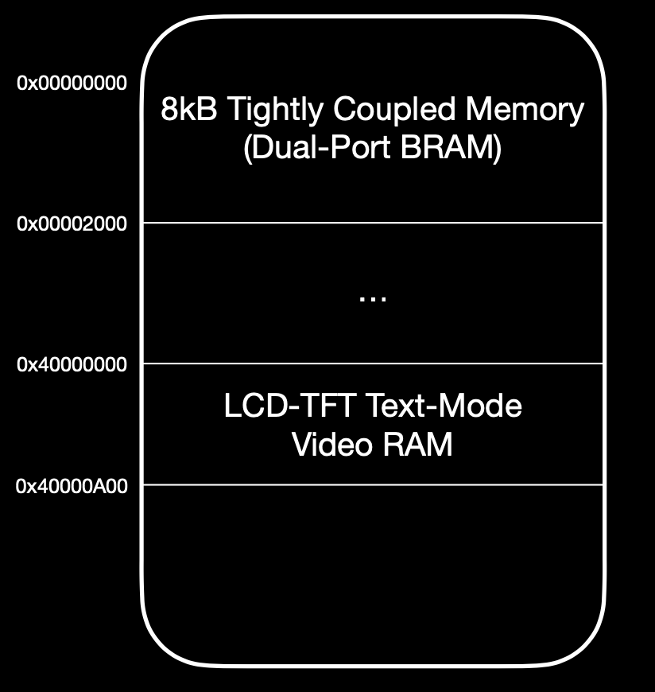

# pretty-secure-processor

Pretty Secure Processor is a complete synthesizable SoC featuring a custom 5-stage pipelined RISC-V CPU core with precise exception support, a LCD display driver circuit, and several architectural security enhancements to protect control flow integrity within the core.

# Interface

The processor features a memory-mapped LCD controller that can output data to a real 800 by 480 pixel LCD screen over the 40-pin parallel RGB protocol. The LCD controller supports text mode graphics at a resolution of 80 columns by 32 rows. The LCD controller also supports hardware sprites as can be seen below.

The LCD is attached to the processor using the [Adafruit TFT Friend](https://www.adafruit.com/product/1932), which provides a boost converter for powering the backlight, as well as a way to route the signals into the flex PCB cable.

Image 1: The processor displaying the TCM RAM hash and a hello world, along with a hardware sprite.

Image 2: The hardware sprite generator displaying copies of the logo sprite.

# Core Architecture
The core is a 5-stage pipelined RISC-V core that supports the majority of the RV32I ISA [10]. Below is a diagram of the processor datapath with emphasis on the architectural security features unique to Pretty Secure Processor.

## Pointer HMACs
Pointer HMACs are signatures placed in the upper 2 bytes of a pointer that verify the lower 2 bytes. If a malicious program attempts to gain control of code execution by modifying the pointer, the signature will no longer match and the processor will throw an exception upon attempting to return to this address. As the Pretty Secure Processor's TCM RAM ranges from `0x00000000` to `0x00002000`, the upper 2 bytes will always be `0x0000`, so we use these bytes to store the HMAC.

Currently, the HMAC scheme used XORs the lower 2 bytes of the pointer with a processor secret key (this is to keep the latency of signing to a constant time to prevent introducing side channel attack vectors). By analyzing encrypted pointers, an attacker could easily leak the secret key and sign their own pointer HMACs. This scheme is not cryptographically secure, however it is valuable regardless, as it adds a "tamper resistance" to the pointer that would not be found without it. A dedicated attacker would be able to bypass this scheme as it currently stands. In the future I want to expand this scheme with a cryptographically secure HMAC.

Pointer HMACs are an implementation of Pointer Authentication Codes, which are an architectural security feature found in ARM processors [16].

The benefit of this feature is that it is architecturally transparent to the program running on the chip- nothing extra needs to be done in order for this feature to work. However, as the HMAC is 16 bits long, it is inherently bruteforceable by nature. Secure Calls are an even more secure programming interface, however, they do require postprocessing generated code to add (as they are implemented by separate opcodes from `jal`/`jalr`).

## Secure Calls
Secure Calls are a new way to call subroutines. The call stack is split into two architecturally distinct stacks, the i-stack and d-stack, where the i-stack is backed by a region of shadow memory not accessible anywhere else in the core. This allows for secure call and secure return to provide complete control flow integrity guarantees.

In stack-based buffer overflow attacks, call linkage information is stored on the same stack as data, which means that if an overflow allows for overwriting of stack information, then the call linkage can also be changed. This allows attackers to redirect code flow by changing where the return address points, or creating fake stack frames and performing ROP attacks. With an architecturally distinct stack just for call information, such attacks are impossible.

The only way the contents of the secure stack can be written to is via a secure call, and the secure stack can never be read. It can only be jumped to by a secure return instruction.

`scall` has the same instruction format as `jal` with the opcode encoding `1010011`.

`sret` has the same instruction format as `jalr` with the opcode encoding `1010110`.

At this time, there is no architectural support for an indirect secure call, so all secure call targets must be located within a +/- 1MB range of the caller (direct jump).

## Memory Map
The first 8KB of memory is the executable Tightly Coupled Memory (TCM) RAM region. This region is readable, writeable, and executable by the PSP core. At reset, the core begins execution from `0x00000000`.

The region of memory from `0x40000000` to `0x40000A00` corresponds to text mode video RAM. This region is write-only and provides the core with a way to control the output of the TFT-LCD controller.

## Pipelined LCD Character Driver
The LCD screen features a pipelined text-mode character driver that generates text-mode pixel data on the fly. A framebuffer would be too costly in terms of memory usage, so instead I generate pixel data lazily just before it is needed. As the LCD controller uses dual-port BRAM, there is no bus contention reading character data, and therefore memory access latencies are guaranteed, and the pipeline will be able to generate pixel data exactly when needed.

## Exceptions
Currently, the only supported hardware exception is the "Invalid Pointer HMAC" exception. This exception is thrown when pointer HMACs are enabled in the core, and the program attempts to return to a pointer whose HMAC does not match the lower bits. Right now, this exception traps to register `x30`. In the future I would like to implement a proper vector table for exceptions and interrupts.

# Kernel
Provided is a test kernel that will test a variety of features on the PSP. First, it will read its TCM memory region and compute a checksum / hash and output it to the screen. Then, it will perform a nested series of `scall` / `sret`. Finally, it will test precise exceptions and pointer HMACs by executing some malicious code that attempts to change the saved return address. This should cause an exception upon return as the HMAC has changed, and the exception handler should be called.

With return address HMACs enabled, the malicious subroutine is thwarted and we trap to the exception handler (x30):

With return address HMACs disabled, the malicious subroutine is able to adjust control flow and return to the "this string should never appear" code:

(These are pictures taken of the LCD screen).

# Board
This CPU was designed for the [Pynq Z2 Board](http://www.pynq.io/board.html). The core runs at 62.5 MHz and the LCD controller runs at 31.25 MHz.

# Running in Vivado
To run this in Vivado, first clone the repo somewhere local. Then, create a new Vivado project targetting the Pynq Z2 board.

When prompted to add design sources, add everything in the `hdl` and `memories` folders, as well as `kernel/kernel.mem`. This will allow the memory initialization files to be found by Vivado without the need to specify absolute paths.

To get simulation working, add everything in `hvl`, `memories`, and `kernel/kernel.mem` as simulation sources. Note that the memory initialization files need to be added again here.

A Vivado project file is included at `psp_vivado_project_clean.xpr.zip`, however, it is recommended you create your own Vivado project and pull the code in from git by hand. This is so that you can easily pull new commits and compile test code without needing to copy memory initialization files around everywhere.

## Simulation
For simulation, set the top testbench to be one of the following:

`hvl/tb_psp.sv`: Test the entire core

`hvl/tb_tft.sv`: Test the LCD-TFT Subsystem

`hvl/tb_memory.sv`: Test the TCM Memory

To enable `rvfi` verification, edit `hvl/tb_psp.sv` line 59 to remove the `& 0` preventing `rvfi` from receiving any instructions. This is in place because `rvfi` will throw unnecessary errors when PSP special operations happen (pointer HMACs or secure call/ secure ret).

## Synthesis
To synthesize the processor, set the top level module to be `hdl/psp.sv`.

Make sure to add `hdl/constraints.xdc` to the project!

# Project History
This project began as my final project for ECE 527: System on a Chip Design.

# References
The project logo includes a graphic from Apple's Keynote software [2].

